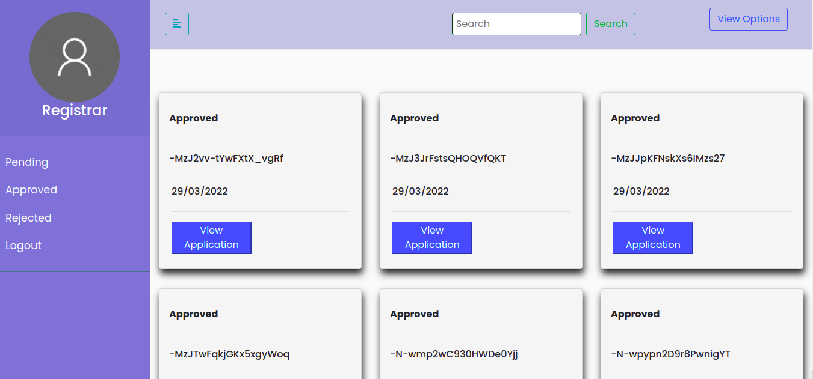

# DEP.Y9
Purchase management

## Overview

### The Challenge

Indenter should be able to:

- Can Create form or apply new application
- Can Drop his application
- Can View Status of his application
- Can search the application by application Id
- See hover states for interactive elements
- Can View the application in both grid and List Layout
- Can reset his password if needed

Approvers should be able to:

- Can View all the applications requested by indenters for his approval
- Can Approve or Reject the application
- Can View separately approved, rejected, and Pending applications
- Can search the application by application Id
- See hover states for interactive elements
- Can View the application in both grid and List Layout
- Can reset his password if needed

### Links

- Live Site URL: [https://sahdev1115app.herokuapp.com/login](https://sahdev1115app.herokuapp.com/login)

## Process

### Built with

- Flask
- HTML, CSS Grid and bootstrap
- Google Auth (Google Sheets API)
- Javascript
- Firebase
- Heroku

### Deployment

##### Steps
###### First Time
 - git init
 - git add --all
 - git commit -m "Initial Commit"
 - heroku login
 - heroku create appname
 - git puch heroku master

###### Save Changes
 - git init
 - git add .
 - git commit -m "Initial Commit"
 - git puch heroku main

### requrements
 - Install below packeges in a virtual environment
 - activate the environment
 - Compile app.py : python3 app.py

cachelib==0.6.0
cachetools==5.0.0
certifi==2021.10.8
cffi==1.15.0
charset-normalizer==2.0.12
click==8.1.3
cryptography==37.0.2
Deprecated==1.2.13
Flask==2.1.2
Flask-MySQLdb==1.0.1
Flask-Session==0.4.0
gcloud==0.18.3
google-auth==2.6.6
google-auth-oauthlib==0.5.1
googleapis-common-protos==1.56.0
gspread==5.3.2
gunicorn==20.1.0
httplib2==0.20.4
idna==3.3
importlib-metadata==4.11.3
itsdangerous==2.1.2
Jinja2==3.1.2
jwcrypto==1.2
MarkupSafe==2.1.1
mysql-connector==2.2.9
mysqlclient==2.1.0
numpy==1.22.3
oauth2client==4.1.3
oauthlib==3.2.0
pandas==1.4.2
protobuf==4.21.0rc1
pyasn1==0.4.8
pyasn1-modules==0.2.8
pycparser==2.21
pycryptodome==3.14.1
PyMySQL==1.0.2
pyparsing==3.0.9
Pyrebase4==4.5.0
python-dateutil==2.8.2
python-jwt==3.3.2
pytz==2022.1
requests==2.27.1
requests-oauthlib==1.3.1
requests-toolbelt==0.9.1
rsa==4.8
six==1.16.0
urllib3==1.26.9
Werkzeug==2.1.2
wrapt==1.14.1
zipp==3.8.0
